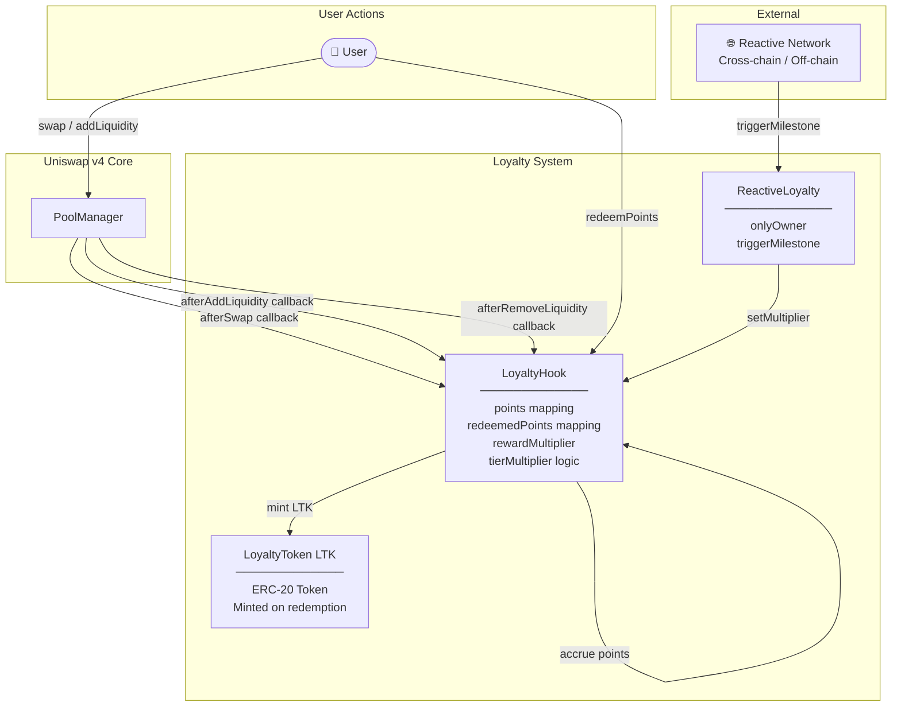

# 🎯 Uniswap v4 Reactive Loyalty Hook

[](https://soliditylang.org/)
[](https://book.getfoundry.sh/)
[](https://docs.uniswap.org/contracts/v4/overview)
[](https://opensource.org/licenses/MIT)

> A gamified, on-chain loyalty rewards system built as a **Uniswap v4 Hook**. Users earn points for swapping and providing liquidity, climb tiered reward brackets, redeem points for ERC-20 tokens, and have their multipliers dynamically adjusted by a cross-chain **Reactive Network** in response to real-world or cross-chain milestones.

---

## 📋 Table of Contents

- [Overview](#-overview)
- [Key Features](#-key-features)
- [Architecture](#-architecture)
- [Contract Reference](#-contract-reference)
  - [LoyaltyHook](#loyaltyhooksol)
  - [LoyaltyToken](#loyaltytokensol)
  - [ReactiveLoyalty](#reactiveloyaltysol)
- [Point System](#-point-system)
  - [Earning Points](#earning-points)
  - [Tier System](#tier-system)
  - [Multipliers](#multipliers)
  - [Redemption](#redemption)
- [Data Flow](#-data-flow)
- [Project Structure](#-project-structure)
- [Getting Started](#-getting-started)
  - [Prerequisites](#prerequisites)
  - [Installation](#installation)
  - [Build](#build)
  - [Test](#test)
- [Deployment](#-deployment)
  - [Environment Variables](#environment-variables)
  - [Deploy Script](#deploy-script)
- [Hook Callback Matrix](#-hook-callback-matrix)
- [Security Considerations](#-security-considerations)
- [Roadmap](#-roadmap)
- [License](#-license)

---

## 🔭 Overview

This project showcases the power of **Uniswap v4 Hooks** by implementing a fully on-chain loyalty program. Traditional loyalty programs rely on off-chain databases and centralised servers. This hook tracks user behaviour *entirely on-chain* — every swap and liquidity event automatically accrues points directly in the smart contract.

The system is further extended by a **Reactive Layer**: the `ReactiveLoyalty` contract acts as a bridge that allows an authorised Reactive Network (a cross-chain or event-driven automation layer) to trigger **Milestones** that update the global reward multiplier, enabling dynamic, incentive-driven campaigns without manual admin intervention.

### Use cases this demonstrates:
- **DeFi Loyalty Programmes** — reward long-term liquidity providers and active traders
- **Gamified DeFi** — tiered, progression-based reward mechanics entirely on L1/L2
- **Reactive Integrations** — hooks that respond to broader cross-chain or off-chain signals
- **Token-based Redemption** — converting participation into transferable ERC-20 value

---

## ✨ Key Features

| Feature | Description |
|---|---|
| 🔄 **Swap Rewards** | Earn loyalty points proportional to each swap's input amount |
| 💧 **Liquidity Rewards** | Earn 10× boosted points for every unit of liquidity provided |
| ⚠️ **Withdrawal Penalty** | Removing liquidity deducts points, discouraging mercenary capital |
| 🏆 **Tiered Multipliers** | Base / Gold / Platinum tiers give up to 3× permanent point boosts |
| ⚡ **Global Multiplier** | Protocol-wide boosts triggered by the Reactive Network (e.g. Happy Hours, Milestones) |
| 🎁 **Point Redemption** | Burn points to mint `LTK` ERC-20 tokens at a 1-to-1 rate (×10¹⁸) |
| 🌐 **Cross-Chain Ready** | `ReactiveLoyalty` is designed to receive messages from any Reactive Network node |

---

## 🏛 Architecture

The system is composed of three contracts deployed together and linked post-deployment:



### Contract Relationships

```
DeployLoyalty.s.sol
  ├── deploys  ──► LoyaltyHook(poolManager)
  ├── deploys  ──► LoyaltyToken(hook)
  ├── deploys  ──► ReactiveLoyalty(hook)
  ├── links    ──► hook.setLoyaltyToken(token)
  └── links    ──► hook.setReactiveNetwork(reactive)
```

---

## 📄 Contract Reference

### `LoyaltyHook.sol`

The core contract. Implements the `IHooks` interface and is registered with a Uniswap v4 `PoolManager`. All hook callbacks are gated by `onlyManager` to prevent spoofed calls.

**State Variables**

| Variable | Type | Description |
|---|---|---|
| `manager` | `IPoolManager` (immutable) | The Uniswap v4 PoolManager this hook is attached to |
| `reactiveNetwork` | `address` | The authorised `ReactiveLoyalty` contract allowed to set multipliers |
| `loyaltyToken` | `address` | The `LoyaltyToken` (LTK) contract used for redemptions |
| `rewardMultiplier` | `uint256` | Global multiplier for all point calculations (default: 1) |
| `points` | `mapping(address => uint256)` | Accumulated loyalty points per user |
| `redeemedPoints` | `mapping(address => uint256)` | Lifetime redeemed points per user |

**Functions**

| Function | Access | Description |
|---|---|---|
| `afterSwap(...)` | `onlyManager` | Awards `(amount / 1e18) × rewardMultiplier × tierBoost` points |
| `afterAddLiquidity(...)` | `onlyManager` | Awards `(liquidity / 1e18) × 10 × rewardMultiplier × tierBoost` points |
| `afterRemoveLiquidity(...)` | `onlyManager` | Deducts `(liquidity / 1e18) × 10 × rewardMultiplier` points (penalty) |
| `redeemPoints(uint256 amount)` | Public | Burns points, mints equivalent LTK tokens (×10¹⁸) to caller |
| `getTierMultiplier(address)` | View | Returns 1 / 2 / 3 based on user's current point balance |
| `setMultiplier(uint256)` | `onlyReactiveNetwork` | Updates the global `rewardMultiplier` |
| `setLoyaltyToken(address)` | Public* | Links the LTK token contract |
| `setReactiveNetwork(address)` | Public* | Links the `ReactiveLoyalty` controller |

> *These setters are currently unrestricted for development simplicity. In production, they should be restricted to the contract owner.

**Custom Errors**

| Error | Trigger |
|---|---|
| `NotManager()` | A hook callback is called by an address that isn't the PoolManager |
| `NotReactiveNetwork()` | `setMultiplier` is called by an unauthorised address |

---

### `LoyaltyToken.sol`

A minimal, custom **ERC-20 token** (`LTK`) with 18 decimals. It is the on-chain value representation of redeemed loyalty points.

**Key Properties**

| Property | Value |
|---|---|
| Name | `Loyalty Token` |
| Symbol | `LTK` |
| Decimals | `18` |
| Minting | Restricted to `hook` address only |

**Functions**

| Function | Description |
|---|---|
| `mint(address to, uint256 amount)` | Only callable by the `LoyaltyHook`. Called during point redemption. |
| `transfer(address, uint256)` | Standard ERC-20 transfer |
| `approve(address, uint256)` | Standard ERC-20 approval |
| `transferFrom(address, address, uint256)` | Standard ERC-20 delegated transfer |

**Events**

| Event | Trigger |
|---|---|
| `Transfer(from, to, value)` | On every mint and transfer |
| `Approval(owner, spender, value)` | On `approve` |

---

### `ReactiveLoyalty.sol`

The **Reactive Layer controller**. This contract is owned and is designed to be called by a Reactive Network node or a trusted operator in response to off-chain or cross-chain events (e.g. total protocol volume milestones, NFT holder counts, external engagement metrics).

**State Variables**

| Variable | Type | Description |
|---|---|---|
| `loyaltyHook` | `address` | The `LoyaltyHook` contract whose multiplier will be updated |
| `owner` | `address` | The deployer; only they can trigger milestones |

**Functions**

| Function | Access | Description |
|---|---|---|
| `triggerMilestone(string description, uint256 newMultiplier)` | `onlyOwner` | Updates the hook's multiplier and emits `CrossChainMilestoneReached` |

**Events**

| Event | Parameters | Description |
|---|---|---|
| `CrossChainMilestoneReached` | `description (string)`, `multiplier (uint256)` | Emitted whenever a milestone is triggered. Can be indexed by off-chain listeners. |

---

## 🏆 Point System

### Earning Points

Points are calculated automatically whenever the PoolManager calls back into the hook after a user interaction.

#### After Swap
```
points_earned = (|amountSpecified| / 1e18) × rewardMultiplier × tierBoost
```

**Example**: A swap of 10 ETH (10e18) with default multiplier (1) at Base Tier (1x):
```
points = (10e18 / 1e18) × 1 × 1 = 10 points
```

#### After Add Liquidity
```
points_earned = (liquidityDelta / 1e18) × 10 × rewardMultiplier × tierBoost
```

**Example**: Providing 100 ETH of liquidity (100e18) with a 2× milestone multiplier at Gold Tier (2x):
```
points = (100e18 / 1e18) × 10 × 2 × 2 = 4000 points
```

#### After Remove Liquidity (Penalty)
```
points_deducted = (|liquidityDelta| / 1e18) × 10 × rewardMultiplier
```
> ⚠️ The tier boost does **not** apply to penalties. Points cannot go below zero — if the penalty exceeds the balance, points are set to `0`.

---

### Tier System

Tiers are evaluated *dynamically* on every point-accumulating event based on the user's current total points. No separate registration required.

| Tier | Min Points | Tier Multiplier | Description |
|---|---|---|---|
| 🥉 Base | 0 | **1×** | Default for all new users |
| 🥇 Gold | 5,000+ | **2×** | Earned through sustained activity |
| 💎 Platinum | 10,000+ | **3×** | Top-tier users receive maximum rewards |

```solidity
function getTierMultiplier(address user) public view returns (uint256) {
    uint256 userPoints = points[user];
    if (userPoints >= 10000) return 3; // Platinum
    if (userPoints >= 5000)  return 2; // Gold
    return 1;                          // Base
}
```

---

### Multipliers

There are **two independent multipliers** that stack multiplicatively:

| Multiplier | Source | Scope | Default |
|---|---|---|---|
| **Global Reward Multiplier** (`rewardMultiplier`) | Set by `ReactiveLoyalty` | Protocol-wide | `1` |
| **Tier Multiplier** (`getTierMultiplier`) | Derived from user's point balance | Per-user | `1` |

**Total effective multiplier = `rewardMultiplier × tierBoost`**

This means a Platinum user (3×) during a 2× Milestone event earns **6× the base rate**.

---

### Redemption

Users can burn their accumulated points in exchange for `LTK` ERC-20 tokens.

```
LTK minted = amount_of_points × 10^18
```

- Points are **permanently deducted** from the user's balance.
- The deducted amount is tracked in `redeemedPoints` for lifetime statistics.
- Each point redeemed mints **1 full LTK token** (1 × 10¹⁸ wei units).

```solidity
// Redeeming 50 points mints 50 LTK to the caller
hook.redeemPoints(50);
// → points[alice] -= 50
// → redeemedPoints[alice] += 50
// → LoyaltyToken.mint(alice, 50 * 10**18)
```

> Note: Redemption **reduces** the user's point balance, which may affect their tier. Consider timing your redemptions carefully to maintain your tier multiplier.

---

## 🔁 Data Flow

### Swap Flow
```
User ──swap()──► PoolManager ──afterSwap()──► LoyaltyHook
                                               │
                   ┌───────────────────────────┘
                   │  1. Read amountSpecified
                   │  2. getTierMultiplier(sender)
                   │  3. points[sender] += earnings
                   └──► (updated state)
```

### Liquidity Provision Flow
```
User ──addLiquidity()──► PoolManager ──afterAddLiquidity()──► LoyaltyHook
                                                              │
                          ┌───────────────────────────────────┘
                          │  1. Read liquidityDelta
                          │  2. getTierMultiplier(sender)
                          │  3. points[sender] += earnings × 10
                          └──► (updated state)
```

### Reactive Milestone Flow
```
Reactive Network ──trigger event──► ReactiveLoyalty.triggerMilestone()
                                    │
                    ┌───────────────┘
                    │  emit CrossChainMilestoneReached(...)
                    │  ILoyaltyHook(hook).setMultiplier(newMultiplier)
                    └──► LoyaltyHook.rewardMultiplier = newMultiplier
```

### Redemption Flow
```
User ──redeemPoints(amount)──► LoyaltyHook
                               │
         ┌─────────────────────┘
         │  1. Check points[user] >= amount
         │  2. points[user] -= amount
         │  3. redeemedPoints[user] += amount
         │  4. LoyaltyToken.mint(user, amount * 1e18)
         └──► User receives LTK tokens
```

---

## 📁 Project Structure

```
uniswapv4/
├── src/
│   ├── LoyaltyHook.sol        # Core hook — point accrual, tier logic, redemption
│   ├── LoyaltyToken.sol       # ERC-20 token (LTK) awarded on point redemption
│   ├── ReactiveLoyalty.sol    # Reactive layer — cross-chain milestone controller
│   └── Counter.sol            # Foundry default template (unused)
│
├── script/
│   ├── DeployLoyalty.s.sol    # Full deployment script (hook + token + reactive)
│   └── Counter.s.sol          # Foundry default template (unused)
│
├── test/
│   ├── LoyaltyHook.t.sol      # Comprehensive test suite for all loyalty mechanics
│   └── Counter.t.sol          # Foundry default template (unused)
│
├── lib/                       # Git submodule dependencies (v4-core, forge-std)
├── foundry.toml               # Foundry project configuration
└── .gitmodules                # Submodule definitions
```

---

## 🚀 Getting Started

### Prerequisites

- **[Foundry](https://getfoundry.sh/)** — Ethereum development toolkit (Forge + Cast + Anvil)

Install Foundry:
```bash
curl -L https://foundry.paradigm.xyz | bash
foundryup
```

### Installation

```bash
# Clone the repository
git clone <repository-url>
cd uniswapv4

# Install all git submodule dependencies (v4-core, forge-std, etc.)
forge install
```

### Build

Compile all contracts:
```bash
forge build
```

Expected output:
```
[⠒] Compiling...
[⠘] Compiling X files with ...
[⠃] Solc ... finished
Compiler run successful!
```

### Test

Run the full test suite:
```bash
forge test
```

Run with verbose output (shows logs and traces):
```bash
forge test -vvv
```

Run a specific test:
```bash
forge test --match-test test_tier_multiplier -vvv
```

#### Test Coverage

| Test | What It Validates |
|---|---|
| `test_points_on_swap` | 10 ETH swap → 10 points (base rate) |
| `test_points_on_liquidity` | 100 ETH liquidity → 1000 points (10× boost) |
| `test_multiplier_boost` | Reactive milestone sets 2× → swap earns 20 points |
| `test_withdrawal_penalty` | Removing 50 ETH liquidity deducts 500 points |
| `test_tier_multiplier` | Tier progression from Base to Gold unlocks 2× per-user multiplier |
| `test_redemption` | Redeeming 50 points mints 50 LTK and deducts from balance |
| `test_only_reactive_can_set_multiplier` | Unauthorized setMultiplier call reverts with `NotReactiveNetwork` |

---

## 🚢 Deployment

### Environment Variables

Create a `.env` file at the project root:
```bash
# Private key of the deployer wallet (without 0x prefix)
PRIVATE_KEY=your_private_key_here

# Address of the Uniswap v4 PoolManager on your target network
POOL_MANAGER=0x...
```

> ⚠️ **Never commit your `.env` file or expose your private key.** Add `.env` to your `.gitignore`.

### Deploy Script

The `DeployLoyalty.s.sol` script handles the full deployment and wiring in a single transaction batch:

```bash
# Load environment and deploy to a local Anvil node
source .env
forge script script/DeployLoyalty.s.sol --rpc-url http://localhost:8545 --broadcast

# Deploy to a live testnet (e.g. Sepolia)
forge script script/DeployLoyalty.s.sol \
  --rpc-url $SEPOLIA_RPC_URL \
  --broadcast \
  --verify
```

**What the script does, in order:**

1. **Deploys `LoyaltyHook`** — takes the `POOL_MANAGER` address as its constructor argument
2. **Deploys `LoyaltyToken`** — takes the hook address as its constructor argument (so only the hook can mint)
3. **Deploys `ReactiveLoyalty`** — takes the hook address to call `setMultiplier` on
4. **Links `LoyaltyToken`** → calls `hook.setLoyaltyToken(token)`
5. **Links `ReactiveLoyalty`** → calls `hook.setReactiveNetwork(reactive)`

> ⚠️ **Hook Address Mining**: Uniswap v4 hooks require the contract address to have specific bit flags set in the lower bytes to signal which callbacks are implemented. The deploy script as-is does **not** guarantee a correctly-prefixed address. For production deployments, use a hook address mining tool (e.g. `HookMiner` from the v4-periphery repository) or a `CREATE2` factory.

---

## 🔌 Hook Callback Matrix

The following table shows which Uniswap v4 callbacks are implemented and their behaviour:

| Callback | Implemented? | Logic |
|---|---|---|
| `beforeInitialize` | ✅ (passthrough) | Returns selector, no custom logic |
| `afterInitialize` | ✅ (passthrough) | Returns selector, no custom logic |
| `beforeAddLiquidity` | ✅ (passthrough) | Returns selector, no custom logic |
| **`afterAddLiquidity`** | ✅ **Active** | Awards points based on `liquidityDelta` |
| `beforeRemoveLiquidity` | ✅ (passthrough) | Returns selector, no custom logic |
| **`afterRemoveLiquidity`** | ✅ **Active** | Applies point penalty based on `liquidityDelta` |
| `beforeSwap` | ✅ (passthrough) | Returns selector + zero delta, no custom logic |
| **`afterSwap`** | ✅ **Active** | Awards points based on swap `amountSpecified` |
| `beforeDonate` | ✅ (passthrough) | Returns selector, no custom logic |
| `afterDonate` | ✅ (passthrough) | Returns selector, no custom logic |

---

## 🔒 Security Considerations

| Concern | Current State | Recommendation |
|---|---|---|
| `setLoyaltyToken` is unrestricted | ⚠️ Open | Restrict to contract owner (`Ownable`) |
| `setReactiveNetwork` is unrestricted | ⚠️ Open | Restrict to contract owner (`Ownable`) |
| Hook address prefix | ⚠️ Not enforced in script | Use `HookMiner` / `CREATE2` in production |
| Integer underflow on point deductions | ✅ Handled | Points floored at `0` before subtraction |
| `afterSwap` uses `amountSpecified` sign | ✅ Handled | Absolute value taken for negative (exact-input) swaps |
| `onlyManager` modifier on active callbacks | ✅ Protected | All state-changing callbacks require `msg.sender == manager` |
| `onlyReactiveNetwork` on `setMultiplier` | ✅ Protected | Only the registered reactive address can change multipliers |

---

## 🛣 Roadmap

- [x] Core loyalty point accrual (swaps + liquidity)
- [x] Tiered multiplier system (Base / Gold / Platinum)
- [x] Point redemption for ERC-20 `LTK` tokens
- [x] Reactive Network integration for dynamic milestone-based multipliers
- [x] Withdrawal penalty mechanic to discourage mercenary liquidity
- [ ] **Ownable access control** — restrict `setLoyaltyToken` and `setReactiveNetwork`
- [ ] **NFT-based Tiers** — issue tier-specific NFTs (e.g. Gold/Platinum badges) as visual proof of status
- [ ] **Fee Discounts** — allow Platinum/Gold users to swap at reduced fees using accumulated points
- [ ] **Leaderboard Events** — time-boxed competitions tracked fully on-chain
- [ ] **Live Reactive Network** — connect to a production Reactive Network node for autonomous cross-chain triggers
- [ ] **Hook Address Mining** — automate `CREATE2` deployment with correct hook prefix for production

---

## 📄 License

This project is licensed under the **MIT License** — see [LICENSE](./LICENSE) for details.

---

<div align="center">

Built with ❤️ by Wilfred using [Uniswap v4](https://docs.uniswap.org/contracts/v4/overview) & [Foundry](https://book.getfoundry.sh/)

</div>
# VeloHooks
